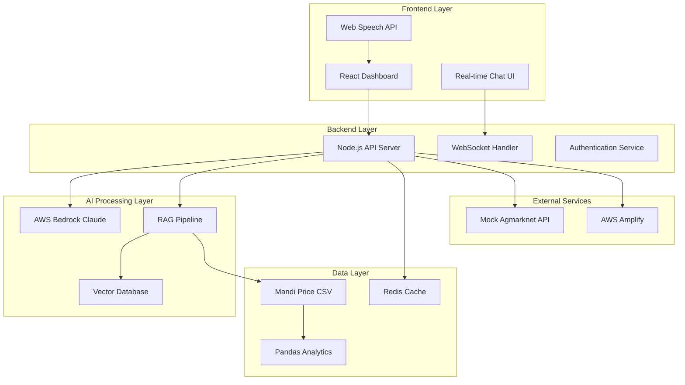

# Design Document: Multilingual Mandi

## Overview

Multilingual Mandi is a full-stack web application that bridges language barriers in Indian agricultural markets through AI-powered translation and price discovery. The system combines a React.js frontend with Node.js backend, leveraging AWS Bedrock's Claude model for multilingual processing and a RAG pipeline for intelligent price recommendations.

The architecture follows a microservices approach with clear separation between the presentation layer (React), business logic (Node.js), AI processing (AWS Bedrock), and data management (CSV-based RAG pipeline with vector embeddings).

## Architecture



## Components and Interfaces

### Frontend Components

**React Dashboard (`src/components/Dashboard.jsx`)**
- Responsive mobile-first design using CSS Grid and Flexbox
- Real-time price display with auto-refresh every 30 seconds
- Language selector for Hindi, Telugu, Tamil, and English
- Voice input toggle with visual feedback indicators

**Chat Interface (`src/components/ChatInterface.jsx`)**
- WebSocket-based real-time messaging
- Message bubbles with language indicators
- Translation status indicators (translating, translated, error)
- Voice input button with recording animation

**Voice Input Handler (`src/components/VoiceInput.jsx`)**
- Web Speech API integration with language detection
- Fallback handling for unsupported browsers
- Audio visualization during recording
- Error handling for microphone permissions

### Backend Services

**API Server (`src/server/app.js`)**
```javascript
// Express.js server with middleware stack
app.use(cors(), helmet(), rateLimit(), compression())
app.use('/api/v1/translate', translateRouter)
app.use('/api/v1/prices', priceRouter)
app.use('/api/v1/negotiate', negotiateRouter)
```

**Translation Service (`src/services/TranslationService.js`)**
- AWS Bedrock Claude integration using AWS SDK v3
- Language detection and validation
- Agricultural terminology preservation
- Response caching for common translations

**Price Discovery Service (`src/services/PriceService.js`)**
- RAG pipeline implementation using vector embeddings
- CSV data processing with pandas-equivalent JavaScript libraries
- Real-time price calculation and trend analysis
- Mock Agmarknet API integration

**Negotiation Service (`src/services/NegotiationService.js`)**
- WebSocket connection management
- AI-mediated conversation flow
- Session state management
- Agreement summarization

### AI Processing Components

**AWS Bedrock Integration (`src/ai/BedrockClient.js`)**
```javascript
const bedrockClient = new BedrockRuntimeClient({
  region: 'us-east-1',
  credentials: fromEnv()
})

const invokeModel = async (prompt, modelId = 'anthropic.claude-3-sonnet-20240229-v1:0') => {
  // Model invocation with proper error handling
}
```

**RAG Pipeline (`src/ai/RAGPipeline.js`)**
- Vector embedding generation using sentence-transformers
- Semantic search across price data
- Context-aware response generation
- Relevance scoring and ranking

## Data Models

### Core Data Structures

**Crop Price Model**
```javascript
{
  id: String,
  cropName: String,
  variety: String,
  price: Number,
  unit: String, // 'kg', 'quintal', 'ton'
  market: String,
  date: Date,
  source: String, // 'agmarknet', 'manual', 'estimated'
  quality: String, // 'premium', 'standard', 'low'
  coordinates: {
    lat: Number,
    lng: Number
  }
}
```

**Translation Request Model**
```javascript
{
  id: String,
  sourceText: String,
  sourceLang: String, // 'hi', 'te', 'ta', 'en'
  targetLang: String,
  translatedText: String,
  confidence: Number,
  timestamp: Date,
  context: String // 'price_query', 'negotiation', 'general'
}
```

**Negotiation Session Model**
```javascript
{
  sessionId: String,
  vendorId: String,
  buyerId: String,
  cropDetails: {
    name: String,
    quantity: Number,
    unit: String,
    quality: String
  },
  messages: [{
    senderId: String,
    originalText: String,
    translatedText: String,
    language: String,
    timestamp: Date,
    messageType: String // 'offer', 'counter', 'accept', 'reject'
  }],
  currentOffer: {
    price: Number,
    quantity: Number,
    terms: String
  },
  status: String, // 'active', 'agreed', 'cancelled'
  aiSuggestions: [String]
}
```

### Database Schema

**CSV Data Structure (`data/mandi_prices.csv`)**
```csv
crop_name,variety,price_per_kg,market,state,date,quality,source
tomato,hybrid,40,Hyderabad,Telangana,2024-01-15,premium,agmarknet
onion,red,30,Hyderabad,Telangana,2024-01-15,standard,agmarknet
chili,green,100,Hyderabad,Telangana,2024-01-15,premium,agmarknet
potato,local,25,Hyderabad,Telangana,2024-01-15,standard,manual
```

**Vector Embeddings Storage**
- Using in-memory vector store for MVP (FAISS or similar)
- Embeddings generated for crop descriptions, market conditions, and price contexts
- Similarity search for relevant price data retrieval

## Error Handling

### Frontend Error Handling

**Voice Input Errors**
- Microphone permission denied: Show fallback text input
- Speech recognition timeout: Retry mechanism with user feedback
- Unsupported language: Graceful degradation to text input
- Network connectivity issues: Offline mode with cached translations

**Translation Errors**
- AWS Bedrock API failures: Retry with exponential backoff
- Invalid language detection: Default to English with user confirmation
- Rate limiting: Queue requests with user notification
- Malformed responses: Fallback to direct text display

### Backend Error Handling

**AWS Integration Errors**
```javascript
const handleBedrockError = (error) => {
  switch (error.name) {
    case 'ThrottlingException':
      return { retry: true, delay: 2000 }
    case 'ValidationException':
      return { retry: false, userError: true }
    case 'AccessDeniedException':
      return { retry: false, configError: true }
    default:
      return { retry: true, delay: 1000 }
  }
}
```

**Data Processing Errors**
- CSV parsing failures: Skip malformed rows with logging
- Vector embedding generation errors: Use cached embeddings
- Price calculation errors: Return historical averages
- WebSocket connection drops: Automatic reconnection with state recovery

### Monitoring and Logging

**Error Tracking**
- Client-side error reporting using browser console and local storage
- Server-side logging with structured JSON format
- AWS CloudWatch integration for production monitoring
- User-friendly error messages in appropriate languages

## Testing Strategy

The testing approach combines unit tests for individual components and property-based tests for universal correctness properties. This dual approach ensures both specific functionality and general system behavior are validated.

**Unit Testing Focus:**
- Component rendering and user interactions
- API endpoint responses and error handling
- Translation accuracy for specific examples
- Price calculation edge cases

**Property-Based Testing Focus:**
- Universal translation properties across all supported languages
- Price discovery consistency across different market conditions
- Negotiation flow integrity regardless of input variations
- Data integrity throughout the RAG pipeline

**Testing Tools:**
- Jest and React Testing Library for frontend unit tests
- Supertest for API endpoint testing
- fast-check library for property-based testing in JavaScript
- Minimum 100 iterations per property test for comprehensive coverage

**Test Configuration:**
Each property test will be tagged with comments referencing the design document:
```javascript
// Feature: multilingual-mandi, Property 1: Translation preserves agricultural terminology
```

## Correctness Properties

*A property is a characteristic or behavior that should hold true across all valid executions of a system—essentially, a formal statement about what the system should do. Properties serve as the bridge between human-readable specifications and machine-verifiable correctness guarantees.*

### Property 1: Translation Accuracy and Terminology Preservation
*For any* agricultural query in Hindi, Telugu, Tamil, or English, the AI translation should preserve the semantic meaning of agricultural terms and produce a standardized format that maintains the original intent.
**Validates: Requirements 1.1, 1.5, 3.2, 8.3**

### Property 2: Query Processing Completeness
*For any* crop query containing name, quantity, and price request, the system should extract all three parameters accurately and validate them before processing.
**Validates: Requirements 1.2, 1.3**

### Property 3: Multilingual Error Handling
*For any* error condition, the system should return error messages in the user's original language with appropriate cultural and linguistic context.
**Validates: Requirements 1.4, 9.4**

### Property 4: Price Discovery Accuracy
*For any* valid crop query, the price discovery system should fetch current market data, calculate accurate averages using available historical data, and suggest fair price ranges within reasonable market bounds.
**Validates: Requirements 2.1, 2.2, 2.3, 6.2**

### Property 5: Bidirectional Translation Consistency
*For any* message pair in different languages during negotiation, translating from language A to B and then back to A should preserve the core meaning and intent.
**Validates: Requirements 3.2, 3.4, 3.5**

### Property 6: Session State Integrity
*For any* negotiation session, the system should maintain consistent state across all operations, preserving conversation history and participant preferences throughout the session lifecycle.
**Validates: Requirements 3.1, 5.3**

### Property 7: Comprehensive Language Support
*For any* supported language (Hindi, Telugu, Tamil, English), all system features should function correctly including UI updates, automatic detection, and appropriate regional formatting.
**Validates: Requirements 8.1, 8.2, 8.4, 8.5**

### Property 8: Voice Input Processing Pipeline
*For any* voice input in supported languages, the system should successfully convert speech to text, pipe it to AWS Bedrock for processing, and maintain the processing pipeline integrity.
**Validates: Requirements 4.2, 4.3, 4.4**

### Property 9: RAG Pipeline Integration
*For any* price query, the RAG pipeline should successfully integrate CSV data as a knowledge source, generate appropriate vector embeddings, and retrieve relevant information for AWS Bedrock processing.
**Validates: Requirements 6.3**

### Property 10: API Integration Reliability
*For any* external API call (AWS Bedrock, mock Agmarknet), the system should implement proper error handling, retry mechanisms, and maintain service reliability.
**Validates: Requirements 5.1, 5.2**

### Property 11: Security and Access Control
*For any* AWS resource access, the system should implement proper authentication, authorization, and security measures to protect sensitive operations.
**Validates: Requirements 7.4**

### Property 12: Caching Effectiveness
*For any* frequently requested price data, the caching system should improve response times while maintaining data accuracy and freshness.
**Validates: Requirements 9.5**

### Property 13: Transaction Logging Completeness
*For any* system operation, all transactions should be logged with sufficient detail for audit and debugging purposes.
**Validates: Requirements 5.5**